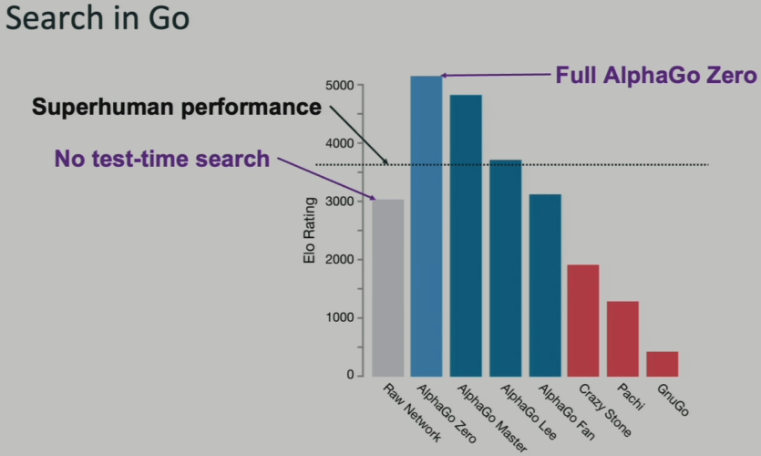

<!-- _class: cover_c "" --> 
<!-- _header: "" --> 
<!-- _footer: "" --> 
<!-- _paginate: "" --> 

# RA Interview
###### —— By 徐博

## 目录

<!-- _class: cols2_ol_ci fglass toc_a  -->
<!-- _footer: "" -->
<!-- _header: "CONTENTS" -->
<!-- _paginate: "" -->

- [引言](#3)
- [对LLM reasoning能力的思考](#14) 
- [LLM应用现状](#16)
- [LLM面临的技术挑战](#20)
- [未来我想做的方向](#32)

## 引言

<!-- _class: trans -->
<!-- _footer: "" -->
<!-- _paginate: "" -->

## 1.1 简述

- 参考[Advancing Reasoning in Large Language Models Promising Methods and Approaches](https://arxiv.org/abs/2502.03671)

- LLMs执行复杂推理的能力往往未能达到预期：
  - Spanning Logical dedution：已知前提A、B，推理出结论C
  - 数学问题解决
  - 常识推理
  - 多步骤推理

- 推理的主要类别：
  - 演绎推理（Deductive Reasoning）: 根据一般性原则推导出具体结论，例如数学定理证明
  - 归纳推理（Inductive Reasoning）: 根据具体实例归纳出一般性原则，例如从观察到的现象中得出规律
  - 溯因推理（Abductive Reasoning）: 根据观察到的现象和一般性原则，给出最合理的解释，例如从观察到的症状中推断出疾病
  - 常识推理（Common Sense Reasoning）: 根据常识和经验进行推理，例如“冬季很冷”推出“多穿衣服”
  - 概率推理（Probabilistic Reasoning）: 根据概率模型和观察数据，进行推理和预测，例如金融预测

## 1.2 LLM推理的挑战
LLM在稳健和可靠推理方面仍面临若干挑战：
1. LLM的幻觉现象
2. 缺乏显式记忆
3. 多步骤推理
4. 偏见和可解释性问题（Strawberry问题？）
5. 跨领域的泛化能力有限

## 1.3 利用传统AI推理技术
为了增强LLM的推理能力，最近的研究探索了将传统推理技术与深度学习相结合的混合模型：
1. 使用结构化推理数据进行微调：在专门的数据集上训练LLM，这些数据集聚焦在逻辑推理和数学问题解决
2. 检索增强推理：通过知识检索机制增强LLM，使其能够将其响应建立在外部事实上
3. 神经符号AI：将神经网络和符号推理框架相结合，以利用两种方式的优势
4. 自监督和强化学习：通过迭代自我训练和奖励机制鼓励模型改进其推理

## 1.4 基于Prompt的推理增强

LLM 通过结构化Prompt展现了涌现的推理能力，无需进行微调

#### 1.4.1 CoT (Chain of Thought)

让LLM逐步生成一条推理链，从问题出发，分阶段拆解直到得出答案

#### 1.4.2 Self-Consistency Prompting

通过生成多个不同的推理路径并选择最一致的答案来提高推理准确性

#### 1.4.3 Tree-of-Thought（ToT）

通过在类似树的结构中探索多种可能的推理路径来扩展CoT

#### 1.4.4 PAL（Program-Aided Language Models）

允许LLM调用外部计算工具（如Python脚本）

## CoT实现对比

## 1.5 增强推理的架构创新

主要关注如何在模型的内部构造或工作机制上进行改进

#### 1.5.1 RAG

让语言模型在回答问题前，先从外部知识库中检索到与问题相关的信息，再将检索到的资料和原始问题拼接后输入模型进行生成

#### 1.5.2 神经-符号混合模型

神经网络在模式识别和从数据中学习方面表现出色，符号AI能进行推理、逻辑判断和显式知识表示。构建混合模型能创建更可解释、通用且稳健的AI系统

#### 1.5.3 记忆增强神经网络（MANNs）

将外部存储和神经网络集成，使模型可以从外部存储模块读取和写入数据，更适合在长序列推理一致性、终身学习和few-shot任务中应用

##

#### 1.5.4 GNNs和知识图谱

图神经网络通过显式表示实体及其关系，提供了一个结构化的推理框架，支持逻辑推理和多跳问答（multi-hop question-answering）

#### 1.5.5 工具使用和API增强

类似上述PAL，但概念更宽泛，让LLM可以使用外部工具（例如搜索引擎）和API来增强推理能力，利用语言建模之外的专用计算资源

PAL归类在Prompt-based推理增强，因为PAL依赖Prompt设计

而`工具和API`归类在架构创新，因为它需要在推理过程中进行更灵活且复杂的系统协同

实验证明：在结构化推理任务中，检索增强和神经-符号模型的表现优于标准transformer架构

## 1.6 基于学习的推理方法

核心思路：在不大幅改变已有的LLM结构的前提下，调整或设计新的训练/学习方法

#### 1.6.1 在特定推理的数据集上SFT

通过在特定的推理数据集上进行有监督微调，能让模型更精确地掌握某类推理任务。常用的推理数据集包括：
- GSM8K：中小学数学题集
- MATH：涵盖高中及竞赛数学题，考查较高难度的数学推理
- LogiQA：考察抽象的逻辑推理和阅读理解能力
- ARC：覆盖若干领域的常识和推理题
- HotpotQA：多跳推理题，需要跨多个文档进行信息检索

如果数据集质量高且包含足够多的推理示例，模型在该领域的推理能力会显著增强。不过，这也带来泛化性、跨领域迁移等问题

##
#### 1.6.2 RLHF
1. SFT：$Model_{pre-trained} + Dataset_{SFT}\to Model_{SFT}$
2. 训练奖励模型RM：RM可以是另一个经过微调的 LM，也可以是根据偏好数据从头开始训练的 LM，$Model_{reward}+Dataset_{human-ranked} \to Model_{trained}$
3. 用强化学习微调：
    - Policy：一个接收提示并返回一系列文本（或文本概率分布）的LM
    - action space：LM的词表对应的所有token
    - observation space：可能的输入token序列
    - reward function：是偏好模型和Policy shift constraint的结合

##
#### 1.6.3 自监督学习（SSL）和对比学习（CL）

- SSL：模型可以在海量**无标注**文本中自行构造伪任务（例如预测下一句、填空、生成合理推理步骤等），从中积累对逻辑结构的感知
- CL：鼓励模型分辨有效推理链和无效推理链的差异，通过接近正确推理示例和远离错误推理示例，帮助模型形成更一致、更明确的逻辑表征

#### 1.6.4 自动验证器和Critic model

在主模型外训练一个Critic model检查主模型的推理步骤，一旦发现不合理之处，就提出警示或要求修改，进而将这类评价结果反馈到训练或推断过程中，实现对主模型推理质量的改进

## LLM reasoning发展

<!-- _class: trans -->
<!-- _footer: "" -->
<!-- _paginate: "" -->

## InstructGPT

## Reward Hacking

from：[Learning to summarize from human feedback](https://proceedings.neurips.cc/paper/2020/file/1f89885d556929e98d3ef9b86448f951-Paper.pdf)

  

## DeepSeek Math

[发布于2024年2月，大小7b](https://huggingface.co/deepseek-ai/deepseek-math-7b-instruct)

在Math基准榜单上的表现却超过了多个30B~70B参数量的开源模型

关键因素：
1. DeepSeek-Math 语料库，这是一个包含 120B 个数学tokens的大规模高质量预训练语料库
2. GRPO

base model：DeepSeek-Coder-Base-V1.5 7B

现象：
1. Pre-Training阶段
    - math training在增强model数学能力的同时，还扩大了其**一般推理能力**
    - code training有利于math reasoning能力的提升
    - ArXiv论文好像对提高math reasoning无效（未充分研究）

##

one-stage混合训练可以缓解two-stage训练导致的灾难性遗忘问题，并协同了coding和program-aided mathematical reasoning

##
2. Reinforcement Learning阶段
    - 提供了一个统一范式来分析不同训练方法
    - RL提升了TopK中正确回答的概率，而不是提升了模型的基本能力
    - 使用WEAK-TO-STRONG对齐方式会为学习算法带来根本性的变化

## 思考
不要给模型人为注入inductive bias，虽然加入bias，model在train时variance会减少，但会影响model performance上限

> 现在的各种Agentic Workflow就是各种带structure的东西，它一定会限制模型的能力。所以，Agentic Workflow只有短期价值，没有长期价值！早晚会被模型本身能力取代掉。All in All 我们就是要训练模型能够像我们人一样思考，自由的思考！

1. 要训练llm通过RL做题，有精确reward
2. 不要采取结构化的方法，最终会限制住模型的效果，要让模型自己探索思考范式
3. 思考包含了搜索过程，允许犯错

单独训练一个reward model不一定是必要的，训练reward model既容易导致reward hacking，又容易因为reward model的性能影响model的性能

所以最直接的方法是训练LLM通过RL做题，特别是代码、数学这些有精确答案的问题，这样就有精确reward

## DeepSeek-R1

## LIMO: Less is More for Reasoning

[Code](https://github.com/GAIR-NLP/LIMO)

> 对于已经预训练了海量知识的 LLM 来说，提升其推理能力的关键，不在于数据的绝对数量，而在于训练数据的质量和模型利用自身知识的方式

- 提供了一个仅包含817个样本的高质量[数据集](https://huggingface.co/datasets/GAIR/LIMO)

结论：
1. 推理链质量越高，模型性能越好
2. 训练题目难度越高，越能激发模型更深层次的推理能力
3. 预训练阶段积累的知识越丰富，模型越能有效地利用少量高质量的 LIMO 数据进行学习，从而获得更强大的推理能力
4. LIMO模型展现出强大的自我反思能力

## 两个重要思路

report: [kimi-k1.5](https://github.com/MoonshotAI/kimi-k1.5)

1. 让模型学会自行search
2. less structure很重要

[The Bitter Lesson-(Richard Sutton)](https://www.cs.utexas.edu/~eunsol/courses/data/bitter_lesson.pdf)

> One thing that should be learned from the bitter lesson is the great power of general purpose methods, of methods that continue to scale with increased computation even as the available computation becomes very great. The two methods that seem to scale arbitrarily in this way are **search** and **learning**.

##
from：[Parables on the Power of Planning in AI: From Poker to Diplomacy: Noam Brown (OpenAI)](https://www.youtube.com/watch?v=eaAonE58sLU)

##
from：[MIT EI seminar, Hyung Won Chung from OpenAI. "Don't teach. Incentivize."](https://www.youtube.com/watch?v=kYWUEV_e2ss)
