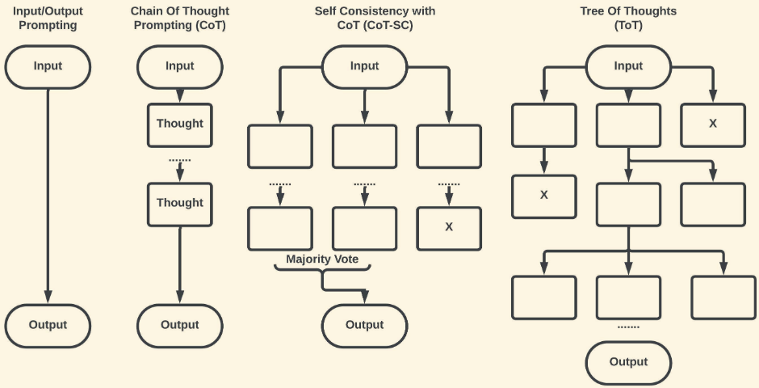
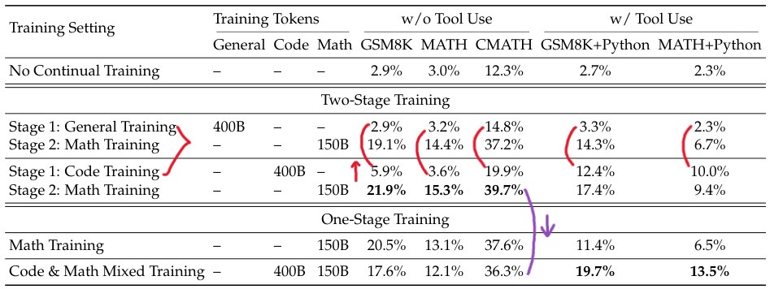

<!-- _class: cover_c "" --> 
<!-- _header: "" --> 
<!-- _footer: "" --> 
<!-- _paginate: "" --> 

# RA Interview
###### —— By 徐博

## 目录

<!-- _class: cols2_ol_ci fglass toc_a  -->
<!-- _footer: "" -->
<!-- _header: "CONTENTS" -->
<!-- _paginate: "" -->

- [引言](#3)
- [LLM reasoning发展](#14) 
- [我的思考](#31)
- [未来打算](#37)

## 引言

<!-- _class: trans -->
<!-- _footer: "" -->
<!-- _paginate: "" -->

## 1.1 简述

- 参考[Advancing Reasoning in Large Language Models Promising Methods and Approaches](https://arxiv.org/abs/2502.03671)

- LLMs执行复杂推理的能力往往未能达到预期：
  - Spanning Logical dedution：已知前提A、B，推理出结论C
  - 数学问题解决
  - 常识推理
  - 多步骤推理

- 推理的主要类别：
  - 演绎推理（Deductive Reasoning）: 根据一般性原则推导出具体结论，例如数学定理证明
  - 归纳推理（Inductive Reasoning）: 根据具体实例归纳出一般性原则，例如从观察到的现象中得出规律
  - 溯因推理（Abductive Reasoning）: 根据观察到的现象和一般性原则，给出最合理的解释，例如从观察到的症状中推断出疾病
  - 常识推理（Common Sense Reasoning）: 根据常识和经验进行推理，例如“冬季很冷”推出“多穿衣服”
  - 概率推理（Probabilistic Reasoning）: 根据概率模型和观察数据，进行推理和预测，例如金融预测

## 1.2 LLM推理的挑战
LLM在稳健和可靠推理方面仍面临若干挑战：
1. LLM的幻觉现象
2. 缺乏显式记忆
3. 多步骤推理
4. 偏见和可解释性问题（Strawberry问题？）
5. 跨领域的泛化能力有限

## 1.3 利用传统AI推理技术
为了增强LLM的推理能力，最近的研究探索了将传统推理技术与深度学习相结合的混合模型：
1. 使用结构化推理数据进行微调：在专门的数据集上训练LLM，这些数据集聚焦在逻辑推理和数学问题解决
2. 检索增强推理：通过知识检索机制增强LLM，使其能够将其响应建立在外部事实上
3. 神经符号AI：将神经网络和符号推理框架相结合，以利用两种方式的优势
4. 自监督和强化学习：通过迭代自我训练和奖励机制鼓励模型改进其推理

## 1.4 基于Prompt的推理增强

LLM 通过结构化Prompt展现了涌现的推理能力，无需进行微调

#### 1) CoT (Chain of Thought)

让LLM逐步生成一条推理链，从问题出发，分阶段拆解直到得出答案

#### 2) Self-Consistency Prompting

通过生成多个不同的推理路径并选择最一致的答案来提高推理准确性

#### 3) Tree-of-Thought（ToT）

通过在类似树的结构中探索多种可能的推理路径来扩展CoT

#### 4) PAL（Program-Aided Language Models）

允许LLM调用外部计算工具（如Python脚本）

## CoT实现对比

## 1.5 增强推理的架构创新

主要关注如何在模型的内部构造或工作机制上进行改进

#### 1) RAG

让语言模型在回答问题前，先从外部知识库中检索到与问题相关的信息，再将检索到的资料和原始问题拼接后输入模型进行生成

#### 2) 神经-符号混合模型

神经网络在模式识别和从数据中学习方面表现出色，符号AI能进行推理、逻辑判断和显式知识表示。构建混合模型能创建更可解释、通用且稳健的AI系统

#### 3) 记忆增强神经网络（MANNs）

将外部存储和神经网络集成，使模型可以从外部存储模块读取和写入数据，更适合在长序列推理一致性、终身学习和few-shot任务中应用

##

#### 4) GNNs和知识图谱

图神经网络通过显式表示实体及其关系，提供了一个结构化的推理框架，支持逻辑推理和多跳问答（multi-hop question-answering）

#### 5) 工具使用和API增强

类似上述PAL，但概念更宽泛，让LLM可以使用外部工具（例如搜索引擎）和API来增强推理能力，利用语言建模之外的专用计算资源

PAL归类在Prompt-based推理增强，因为PAL依赖Prompt设计

而`工具和API`归类在架构创新，因为它需要在推理过程中进行更灵活且复杂的系统协同

实验证明：在结构化推理任务中，检索增强和神经-符号模型的表现优于标准transformer架构

## 1.6 基于学习的推理方法

核心思路：在不大幅改变已有的LLM结构的前提下，调整或设计新的训练/学习方法

#### 1) 在特定推理的数据集上SFT

通过在特定的推理数据集上进行有监督微调，能让模型更精确地掌握某类推理任务。常用的推理数据集包括：
- GSM8K：中小学数学题集
- MATH：涵盖高中及竞赛数学题，考查较高难度的数学推理
- LogiQA：考察抽象的逻辑推理和阅读理解能力
- ARC：覆盖若干领域的常识和推理题
- HotpotQA：多跳推理题，需要跨多个文档进行信息检索

如果数据集质量高且包含足够多的推理示例，模型在该领域的推理能力会显著增强。不过，这也带来泛化性、跨领域迁移等问题

##
#### 2) RLHF
1. SFT：$Model_{pre-trained} + Dataset_{SFT}\to Model_{SFT}$
2. 训练奖励模型RM：RM可以是另一个经过微调的 LM，也可以是根据偏好数据从头开始训练的 LM，$Model_{reward}+Dataset_{human-ranked} \to Model_{trained}$
3. 用强化学习微调：
    - Policy：一个接收提示并返回一系列文本（或文本概率分布）的LM
    - action space：LM的词表对应的所有token
    - observation space：可能的输入token序列
    - reward function：是偏好模型和Policy shift constraint的结合

##
#### 3) 自监督学习（SSL）和对比学习（CL）

- SSL：模型可以在海量**无标注**文本中自行构造伪任务（例如预测下一句、填空、生成合理推理步骤等），从中积累对逻辑结构的感知
- CL：鼓励模型分辨有效推理链和无效推理链的差异，通过接近正确推理示例和远离错误推理示例，帮助模型形成更一致、更明确的逻辑表征

#### 4) 自动验证器和Critic model

在主模型外训练一个Critic model检查主模型的推理步骤，一旦发现不合理之处，就提出警示或要求修改，进而将这类评价结果反馈到训练或推断过程中，实现对主模型推理质量的改进

## LLM reasoning发展

<!-- _class: trans -->
<!-- _footer: "" -->
<!-- _paginate: "" -->

## InstructGPT

## Reward Hacking

from：[Learning to summarize from human feedback](https://proceedings.neurips.cc/paper/2020/file/1f89885d556929e98d3ef9b86448f951-Paper.pdf)

  

## DeepSeek Math

[发布于2024年2月，大小7b](https://huggingface.co/deepseek-ai/deepseek-math-7b-instruct)

在Math基准榜单上的表现却超过了多个30B~70B参数量的开源模型

关键因素：
1. DeepSeek-Math 语料库，这是一个包含 120B 个数学tokens的大规模高质量预训练语料库
2. GRPO

base model：DeepSeek-Coder-Base-V1.5 7B

现象：
1. Pre-Training阶段
    - math training在增强model数学能力的同时，还扩大了其**一般推理能力**
    - code training有利于math reasoning能力的提升
    - ArXiv论文好像对提高math reasoning无效（未充分研究）

##

one-stage混合训练可以缓解two-stage训练导致的灾难性遗忘问题，并协同了coding和program-aided mathematical reasoning

##
> RL已被证明能够有效地在SFT阶段后进一步提高LLM的math reasoning能力

2. Reinforcement Learning阶段
    - 提供了一个统一范式来分析不同训练方法：

    $$
    \text{关于参数}\theta\text{的梯度}: 
    \nabla_\theta \mathcal{J}_{\mathcal{A}}(\theta)=\mathbb{E}[\underbrace{(q, o) \sim \color{red}\mathcal{D}}_{\text {Data Source }}](\frac{1}{|o|} \sum_{t=1}^{|o|} \underbrace{G C_{\mathcal{A}}\left(q, o, t, {\color{red}\pi_{r f}} \right)}_{\text {Gradient Coefficient }} \nabla_\theta \log \pi_\theta\left(o_t \mid q, o_{t-1}\right))
    $$

    其中$\pi_{r f}$是奖励函数，是训练奖励信号的来源

    - RL提升了TopK中正确回答的概率，而不是提升了模型的基本能力
    - 使用WEAK-TO-STRONG对齐方式会为学习算法带来根本性的变化

## LIMO: Less is More for Reasoning

[Code](https://github.com/GAIR-NLP/LIMO)

> 对于已经预训练了海量知识的 LLM 来说，提升其推理能力的关键，不在于数据的绝对数量，而在于训练数据的质量和模型利用自身知识的方式

- 提供了一个仅包含817个样本的高质量[数据集](https://huggingface.co/datasets/GAIR/LIMO)

结论：
1. 推理链质量越高，模型性能越好
2. 训练题目难度越高，越能激发模型更深层次的推理能力
3. 预训练阶段积累的知识越丰富，模型越能有效地利用少量高质量的 LIMO 数据进行学习，从而获得更强大的推理能力
4. LIMO模型展现出强大的自我反思能力

## 

##

## DeepSeek-R1-Zero

在 Base Model （DeepSeek-V3）中直接采用强化学习（GRPO）的方式做模型训练，其中 RL 部分的 Reward 采用的精确的奖励（Accuracy Reward）

#### 数据构建

让模型去回答问题，回答问题的格式要符合以下格式：
- 思考的步骤要包含在 `<think>思考过程</think>`
- 最终的结果要包含在 `<answer>最终结果</answer>`
- 并且需要让模型先思考，然后再问题

##
#### 强化学习

- 减少了 value/critic model，这样可以节约资源，方便 scaling
- 或许一定程度上减少了 Reward hacking（?）
而在这一步强化学习中，DeepSeek 采用的奖励有两种：
- 最终结果的精确奖励。模型最终输出的答案是否正确
- 中间格式的格式奖励。模型是否先输出 `<think>xxx</think>`，然后输出`<answer>xxx</answer>` 这样的格式

##
#### 启发
- 仅通过 RL，没有 SFT 就可以让模型的推理能力提升到一个不可思议的水平
- 模型在 RL 阶段，具有明显的进化。随着 RL 的训练步数越来越多，效果越来越好
- 模型在 RL 的催化下产生自我进化的能力。具体是指：越训练，模型的思考越长，输出的 token 越多。模型会在中间的思考过程中出现**反思、纠正、重新评估、重新探索**等行为增强模型思考和解决问题的能力
- 模型会在训练的时候产生顿悟能力（aha moment），模型会对一些重要的步骤进行标记（flag），给更多的思考和评估的token

## DeepSeek-R1

DeepSeek-R1-Zero存在模型可读性问题，冷启动方式去重新训练一个DeepSeek-R1-Zero（With-ColdStart）

  - 找一部分 long-cot 的数据作为 few-shot，通过 prompt engeering 让模型生成具有反思和验证的回答（本质上也是 long-cot），以及收集 DeepSeek-r1-zero-no-coldstart 产生的结果（这部分结果要通过人工标注修改、过滤）

假设收集到了cold start数据，还需要从 deepseek-v3-base 中作为 SFT 的训练起点，然后得到 DeepSeek-v3-base-with-coldstart-sft 模型

  - 可读性：coldstart 数据设置成了 `|spcial_token|<reasoning_process>|special_token|
`，但是前面已经知道了 DeepSeek-r1-no-coldstart 产生的数据是 `<think>思考过程</think><answer>最终结果</answer> 格式`，为什么这里又要设计一个新的格式？
  - reasoning 能力更高：因为cold start做了一次人工筛选，相当于做了潜在的人类偏好对齐，因此相对于 DeepSeek-r1-zero-no-coldstart，观察了更好的效果

## 聚焦Reasoning能力的RL

采用和 DeepSeek-r1-zero-no-coldstart 一样的 RL 训练方法，目前是为了产生deepseek-r1-zero-with-coldstart-focus-on-reasoning但是有一些改进。

- base 模型替换。从 deepseek-v3-base 换成了 DeepSeek-v3-base-with-coldstart-sft。也就是上一步生成的结果
- 奖励内容做了替换。DeepSeek-r1-zero-no-coldstart 用的是**格式奖励**和**最终结果奖励**而deepseek-r1-zero-with-coldstart-focus-on-reasoning 采用的是**语言一致性奖励**和**最终结果奖励**。但实际上加了**语言一致性奖励**会略微降低模型的性能

这样得到一个推理能力很强的模型 deepseek-r1-zero-with-coldstart-focus-on-reasoning，它**用来为最终的 deepseek-r1 产生推理训练数据**

## 数据采样

#### 推理数据
收集数据的时候，不再采用 rule-based rewards 了，而是用 deepseek-v3 作为一个 reward-model，评判模型的生成效果的好坏。此外，这里还会把语言混合、具有长段落和代码块的 CoT 样本过滤掉

具体做法是：先让 deepseek-r1-zero-with-coldstart-focus-on-reasoning 对每一个样本生成多条结果，然后用上面两个方式进行过滤，选择其中一条结果，最终得到了 600k 的推理数据样本

#### 非推理数据
直接采用了 deepseek-v3 的部分SFT数据。对于特定的任务，会用 deepseek-v3 产生 CoT 过程，然后再给出答案；而对于简单的问题，则省略了 CoT 的过程。最终一共收集了 200k 的非推理数据

最终共得到了 800k 的 SFT数据，然后把它们用 SFT 训练两个 epoch

##
#### 全场景RL
为了进一步使模型与人类偏好保持一致，再用一个二阶段RL作训练，旨在提高模型的有用性和无害性，同时细化其推理能力
- 对于推理数据，还是和 deepseek-r1-zero 一样，采用规则奖励的模型作奖励信息训练
- 对于非推理数据，采用 reward-model 作为奖励信号，这是为了捕获细微场景的人类偏好
- 有用性上，只关注最终结果的有用性和与问题的相关性，这样可以减少对于推理能力的干扰
- 无害性上，关注整体的推理过程和最终结果

最终，通过这种混合的奖励信号和不同的数据分布，得到了最终的deepseek-r1，在推理上能力很棒，同时保持了有用性和无害性

## DeepSeek-R1-Distill
小一点的模型能不能得到类似的 deepseek-r1 的能力？

方式1：直接用 deepseek-r1 蒸馏数据，让小模型学习（SFT）
方式2：小模型采用 deepseek-r1 同样的 pipeline 作训练，获得这样的能力

结论：从大模型蒸馏的效果好于直接用小模型作RL训练

#### 失败
- Process Reward Model（PRM）
  - 定义一个 PRM 的粒度很难，怎么算是一个 Step 呢？
  - 评估当前的 Step 是否准确很难
  - 训练一个 step rm 很难，容易产生 reward hacking
- Monte Carlo Tree Search（MCTS）
  - 在语言模型中，词表太大了，基本都十几K，因此搜索空间太大了
  - 如果采用最大的探索限制，又容易产生局部最优
  - value model 很难训练，不好评估当前的步骤是否是好的

## 我的思考

<!-- _class: trans -->
<!-- _footer: "" -->
<!-- _paginate: "" -->

##
from：[Parables on the Power of Planning in AI: From Poker to Diplomacy: Noam Brown (OpenAI)](https://www.youtube.com/watch?v=eaAonE58sLU)

##
from：[MIT EI seminar, Hyung Won Chung from OpenAI. "Don't teach. Incentivize."](https://www.youtube.com/watch?v=kYWUEV_e2ss)

## 两个重要思路

report: [kimi-k1.5](https://github.com/MoonshotAI/kimi-k1.5)

1. 让模型学会自行search
2. less structure很重要（什么是structure？）

[The Bitter Lesson-(Richard Sutton)](https://www.cs.utexas.edu/~eunsol/courses/data/bitter_lesson.pdf)

> One thing that should be learned from the bitter lesson is the great power of general purpose methods, of methods that continue to scale with increased computation even as the available computation becomes very great. The two methods that seem to scale arbitrarily in this way are **search** and **learning**.

## 思考
不要给模型人为注入inductive bias（这种思考就是structure），虽然加入bias，model在train时variance会减少，但会影响model performance上限

> 现在的各种Agentic Workflow就是各种带structure的东西，它一定会限制模型的能力。所以，Agentic Workflow只有短期价值，没有长期价值！早晚会被模型本身能力取代掉。All in All 我们就是要训练模型能够像我们人一样思考，自由的思考！

1. 要训练llm通过RL做题，有精确reward
2. 不要采取结构化的方法，最终会限制住模型的效果，要让模型自己探索思考范式
3. 思考包含了搜索过程，允许犯错

单独训练一个reward model不一定是必要的，训练reward model既容易导致reward hacking，又容易因为reward model的性能影响model的性能

所以最直接的方法是训练LLM通过RL做题，特别是代码、数学这些有精确答案的问题，这样就有精确reward

##
**模型做next token prediction的过程本身就是一个rl探索过程**
模型做一个题，在Long CoT下，实际上也在学习做这个题，它输出的整个轨迹就是：$s1,a1,r1,a2,r2,a3,r3,.....$
其中a可以认为是一种解决方法，可以看做action，而r就是reward，但这里是模型自己做reflection得到的reward，可以认为是自带critic model的in context rl

如果模型不会反思，那么犯错了就是错，value就是负值
如果模型会反思，只要知错能改，最终是对的，那过程的错误都不算错误。value就不应该为负
**所以prm一定会不准，因为不需要每个process的分数**
实际不管模型中间做错了什么，只要不是重复的，最后模型做对了，就认为这是一个好的探索，值得鼓励。反之，如果模型一顿探索，最后做错了，那么再努力也是错，要惩罚
> RL训练过程中模型可以自己涌现的：模型会随着训练提升performance也不断增加token数，自然而然的使整个CoT变长

## 未来打算

<!-- _class: trans -->
<!-- _footer: "" -->
<!-- _paginate: "" -->

##
- 聚焦于小模型reasoning能力的提升
- LongCoT能否换为LongToT？
- dataset也至关重要
- 小模型reasoning能力为什么通过蒸馏更能激发？
- ……

## Thanks

<!-- _class: trans -->
<!-- _footer: "" -->
<!-- _paginate: "" -->
